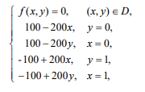
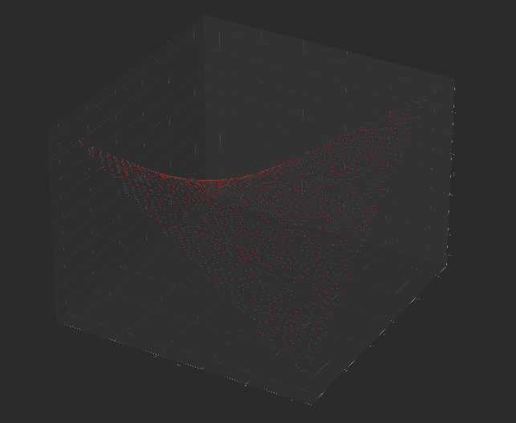

# Task 1. OpenMP

## Предположение

*Вдохновлено osogi*

Введем следующие обозначения:

- $`N`$ - размер стороны сетки не включая границы
- $`CHUNK\_SIZE`$ - размер чанка ($`(N+2)%CHUNK\_SIZE == 0`$)
- $`t(x)`$ - время выполнения в условных единицах
- $`t_n(x)`$ - время выполнения в условных единицах на $`n`$ потоках
- $`iter`$ - количество итераций внешнего цикла внутри алгоритма
- $`\mathoperator{ceil}(x)`$ - округление $`x`$ в большую сторону
- $`CHUNK\_NUM = (N+2) / CHUNK\_SIZE`$ - размер стороны сетки в чанках

Время для алгоритма 11.1 (без параллельности)  
$`t(process) \approx iter*(N^2 * C_1), \ C_1 \in \R`$

Время для алгоритма 11.3 (параллельность по строкам)  
$`t_1(process) \approx iter*(N^2 * C_1 + N * C_2), \ C_1, C_2 \in \R`$
$`t_n(process) \approx iter*(\mathoperator{ceil}(N/n)* N * C_1 + N * C_2), \ C_1, C_2 \in \R`$

Время на один чанк 11.6:  
$`t(process\_chunk) \approx CHUNK\_SIZE^2 * C_1, \ C_1 \in \R`$  
Время на одном потоке 11.6:  
$`t_1(process) = iter*(t(process\_chunk)*CHUNK\_NUM^2 + C_2 * CHUNK\_NUM), \ C_2 \in \R`$
$`t_1(process) = iter*(\underbrace{\displaystyle\sum_{i = 1}^{CHUNK\_NUM}
t(process\_chunk) * \mathoperator{ceil}(i/n)}_{\text{Подъем волны}} +
\underbrace{\displaystyle\sum_{i = 1}^{CHUNK\_NUM - 1} t(process\_chunk) * 
\mathoperator{ceil}(i/n)}_{\text{Спад волны}} + C_2 * CHUNK\_NUM) = `$  
$`= iter*(2 * t(process\_chunk) * \displaystyle\sum_{i = 1}^{CHUNK\_NUM - 1} ceil(i/n) +
t(process\_chunk) * \mathoperator{ceil}(CHUNK\_NUM/n) + C_2 * CHUNK\_NUM), \ C_2 \in \R`$

Подсчеты можно увидеть
в [таблице](https://docs.google.com/spreadsheets/d/1jxdAneSE_nq_82XzDoQFgnv49XIwvKHlEUJbJJ0U0bY/edit?usp=sharing)

а также тут

Для $`N = 98`$, $`CHUNK\_SIZE = 20`$

| Алгоритм | Количество потоков | условное время на итерацию | предположительный прирост производительности |
|----------|--------------------|----------------------------|----------------------------------------------|
| 11.1	    | 1                  | 9604                       | 1                                            |
| 11.3	    | 1	                 | 9702	                      | 0.9898989899                                 |
| 11.3	    | 2	                 | 4900	                      | 1.96                                         |
| 11.3	    | 6	                 | 1764	                      | 5.444444444                                  |
| 11.3	    | 12                 | 980                        | 9.8                                          |
| 11.6	    | 1	                 | 10005                      | 0.95992004                                   |
| 11.6	    | 2	                 | 6005	                      | 1.599333888                                  |
| 11.6	    | 6	                 | 3605	                      | 2.66407767                                   |
| 11.6	    | 12                 | 3605                       | 2.66407767                                   |

Для $`N = 498`$, $`CHUNK\_SIZE = 50`$

| Алгоритм | Количество потоков | условное время на итерацию | предположительный прирост производительности |
|----------|--------------------|----------------------------|----------------------------------------------|
| 11.1     | 1                  | 248004                     | 1                                            |
| 11.3     | 1                  | 248502                     | 0.997995992                                  |
| 11.3     | 2                  | 124500                     | 1.992                                        |
| 11.3     | 6                  | 41832                      | 5.928571429                                  |
| 11.3     | 12                 | 21414                      | 11.58139535                                  |
| 11.6     | 1                  | 250010                     | 0.9919763209                                 |
| 11.6     | 2                  | 137510                     | 1.803534288                                  |
| 11.6     | 6                  | 65010                      | 3.814859252                                  |
| 11.6     | 12                 | 47510                      | 5.220037887                                  |

Для $`N = 498`$, $`CHUNK\_SIZE = 50`$

| Алгоритм | Количество потоков | условное время на итерацию | предположительный прирост производительности |
|----------|--------------------|----------------------------|----------------------------------------------|
| 11.1     | 1                  | 248004                     | 1                                            |
| 11.3     | 1                  | 248502                     | 0.997995992                                  |
| 11.3     | 2                  | 124500                     | 1.992                                        |
| 11.3     | 6                  | 41832                      | 5.928571429                                  |
| 11.3     | 12                 | 21414                      | 11.58139535                                  |
| 11.6     | 1                  | 250010                     | 0.9919763209                                 |
| 11.6     | 2                  | 137510                     | 1.803534288                                  |
| 11.6     | 6                  | 65010                      | 3.814859252                                  |
| 11.6     | 12                 | 47510                      | 5.220037887                                  |

Для $`N = 498`$, $`CHUNK\_SIZE = 100`$

| Алгоритм | Количество потоков | условное время на итерацию | предположительный прирост производительности |
|----------|--------------------|----------------------------|----------------------------------------------|
| 11.1     | 1                  | 248004                     | 1                                            |
| 11.3     | 1                  | 248502                     | 0.997995992                                  |
| 11.3     | 2                  | 124500                     | 1.992                                        |
| 11.3     | 6                  | 41832                      | 5.928571429                                  |
| 11.3     | 12                 | 21414                      | 11.58139535                                  |
| 11.6     | 1                  | 250005                     | 0.9919961601                                 |
| 11.6     | 2                  | 150005                     | 1.65330489                                   |
| 11.6     | 6                  | 90005                      | 2.75544692                                   |
| 11.6     | 12                 | 90005                      | 2.75544692                                   |

Для $`N = 3998`$, $`CHUNK\_SIZE = 100`$

| Алгоритм | Количество потоков | условное время на итерацию | предположительный прирост производительности |
|----------|--------------------|----------------------------|----------------------------------------------|
| 11.1     | 1                  | 15984004                   | 1                                            |
| 11.3     | 1                  | 15988002                   | 0.9997499375                                 |
| 11.3     | 2                  | 7996000                    | 1.999                                        |
| 11.3     | 6                  | 2670664                    | 5.98502994                                   |
| 11.3     | 12                 | 1339330                    | 11.93432836                                  |
| 11.6     | 1                  | 16000040	                  | 0.9989977525                                 |
| 11.6     | 2                  | 8200040                    | 1.949259272                                  |
| 11.6     | 6                  | 3010040                    | 5.310229764                                  |
| 11.6     | 12                 | 1720040                    | 9.29280947                                   |

## Тесты производительности

Тестирование проводилось на операционной системе `Windows 10 22H2` на процессоре `AMD Ryzen 5 4600H` (6 ядер, 12 с
гипертредингом)

### Задача 1

Вид задачи

Задача:

Результат при n=100:

Результаты и сравнения с теоретическими можно увидеть [тут](https://docs.google.com/spreadsheets/d/1jxdAneSE_nq_82XzDoQFgnv49XIwvKHlEUJbJJ0U0bY/edit?usp=sharing#gid=676081853) 