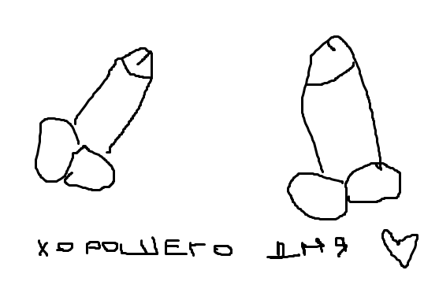
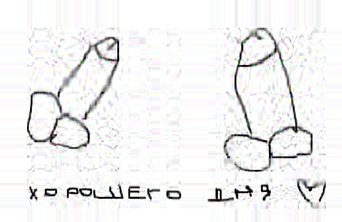
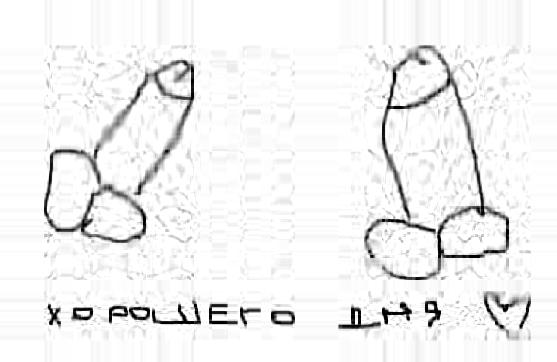
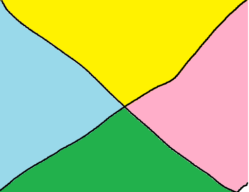
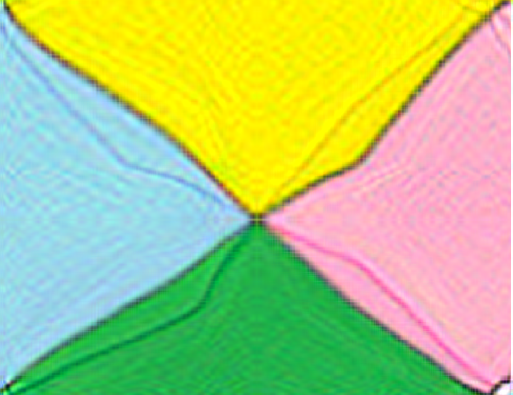
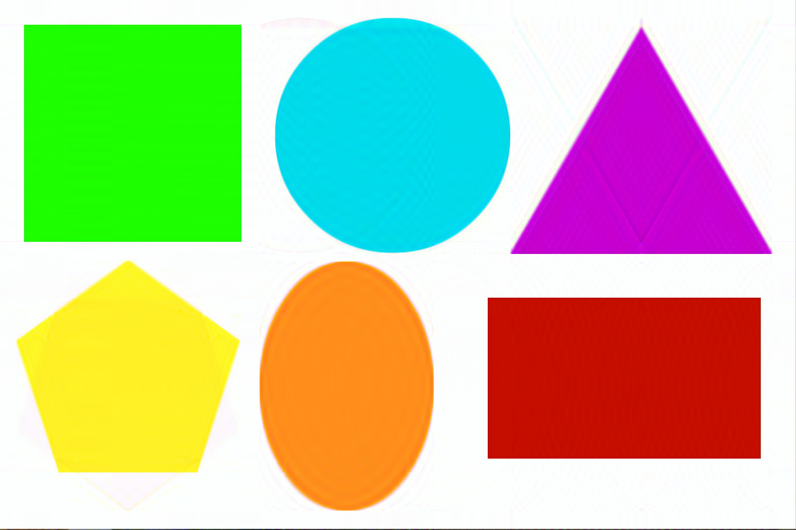
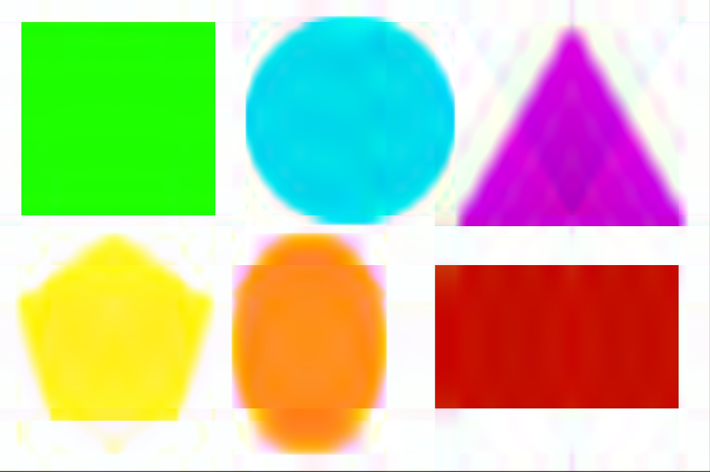

# Эксперимент

---
Были взяты следующие алгоритмы:

- [numpy.linalg.svd](https://numpy.org/doc/stable/reference/generated/numpy.linalg.svd.html) - `npSVD`
- [power method SVD](https://www.jeremykun.com/2016/05/16/singular-value-decomposition-part-2-theorem-proof-algorithm/) - `pwmSVD`
- [block power method SVD](https://www.emis.de/journals/ASUO/mathematics/anale2015vol2/Bentbib_A.H.__Kanber_A..pdf) - `bpmSVD`

---

## Время выполнения

Реализация из numpy является самой быстрой, в то время как блочный метод - самый медленный.

## Сравнение результатов

### параметры:

- изображение сжимается в 2 раза
- для power и block метода используется `tolerance = 10e-2`

### черно-белое изображение

| исходное                                              | numpy                                                                  | power                                                                   | block power                                                             |
|-------------------------------------------------------|------------------------------------------------------------------------|-------------------------------------------------------------------------|-------------------------------------------------------------------------|
|  |  |  |  

тут явно проигрывает power метод, из-за того, что он добавил цветные шумы, хотя изначально картинка была черно-белой.
Numpy
и block power показали примерно одинаковый результат. Оба алгоритма добавили примерно одинаковое количество шумов.

### простое цветное изображение

| исходное                                   | numpy                                                       | power                                                        | block power                                                  |
|--------------------------------------------|-------------------------------------------------------------|--------------------------------------------------------------|--------------------------------------------------------------|
|  |  |  |  |

power метод снова проигрывает - у него получилось более шумное изображение. У numpy и block power примерно одинаковые
результаты.

### изображение в низком разрешении с большим количеством деталей

| исходное                                            | numpy                                                                | power                                                                 | block power                                                           |
|-----------------------------------------------------|----------------------------------------------------------------------|-----------------------------------------------------------------------|-----------------------------------------------------------------------|
|  |  |  |  |

тут результаты одинаковы

### большое изображение с большим кол-вом деталей

| исходное                              | numpy                                                  | power                                                   | block power                                             |
|---------------------------------------|--------------------------------------------------------|---------------------------------------------------------|---------------------------------------------------------|
|  |  |  |  |

На данном изображении разница между алгоритмами невидна.

Попробуем сжать не в 2, а в 4 раза

| исходное                              | numpy                                                    | power                                                     | block power                                               |
|---------------------------------------|----------------------------------------------------------|-----------------------------------------------------------|-----------------------------------------------------------|
|  |  |  |  |

Тут тоже не видно.

### простые фигуры

| исходное                                       | numpy                                                           | power                                                            | block power                                                      |
|------------------------------------------------|-----------------------------------------------------------------|------------------------------------------------------------------|------------------------------------------------------------------|
|  |  |  |  |

Тут видно, что на power методе больше шумов. Результаты numpy и block power одинаковы.

Посмотрим результат на сжатии в 10 раз:

| исходное                                       | numpy                                                             | power                                                              | block power                                                        |
|------------------------------------------------|-------------------------------------------------------------------|--------------------------------------------------------------------|--------------------------------------------------------------------|
|  |  |  |  |

Тут разницы между алгоритмами особо нет. Но можно сделать вывод, что SVD алгоритмы лучше всего работают с прямоугольными фигурами.

---

# Вывод

Алгоритмы можно ранжировать так:

1. numpy (из-за того, что он сильно быстрее, чем block power)
2. block power method
3. power method (проигрывает по качеству)
