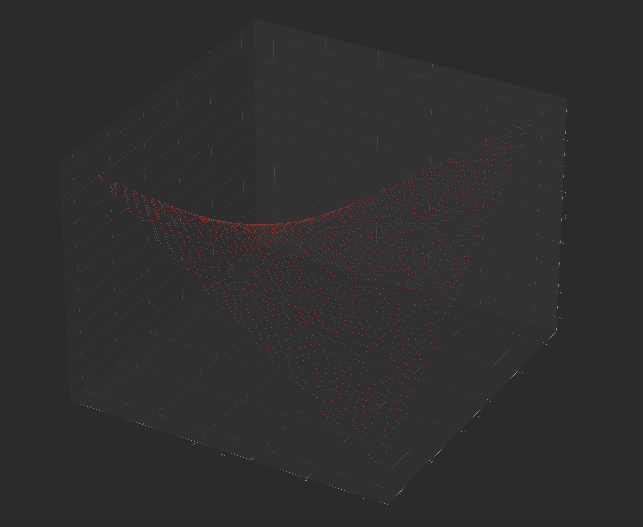

Результаты замеров:
Параметры:
Для функции:

N = 498, Epsilon = 0.0001

- последовательный алгоритм (11.1)
  iterations: 26642,
  time: 69.682374s
- параллельный по строкам (11.3)
  iterations: 26642,
  time: 67.511215s
- параллельный волновой с чанками (11.6), чанк = 50
  iterations: 26642,
  time: 75.742612s
- параллельный волновой с чанками (11.6), чанк = 100
  iterations: 26642,
  time: 71.276658s

